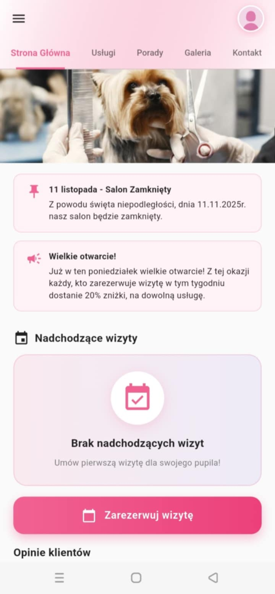
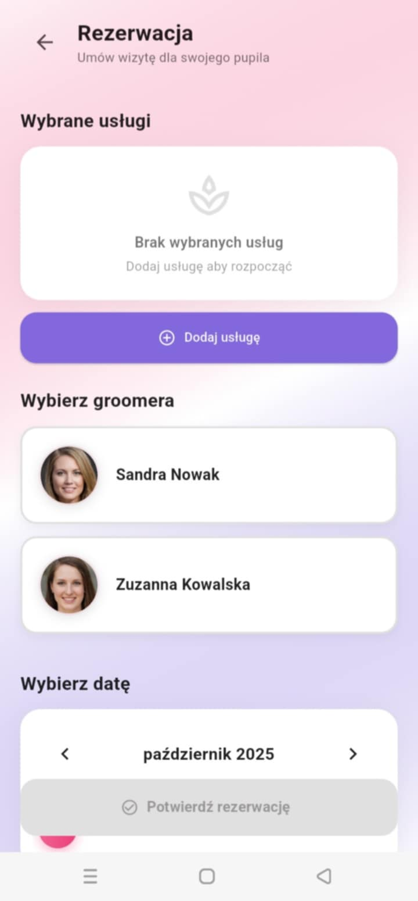
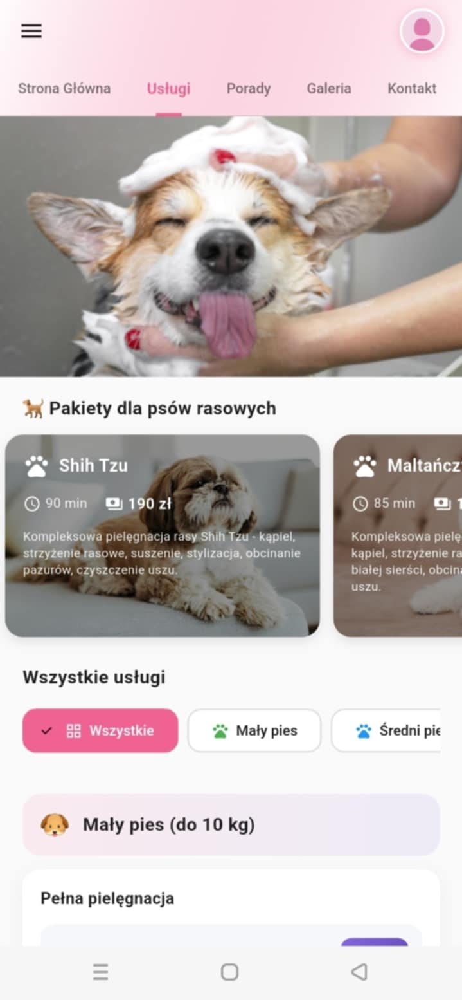
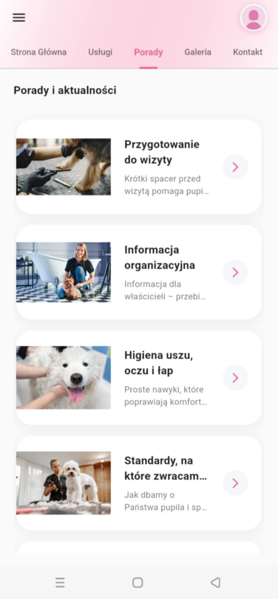
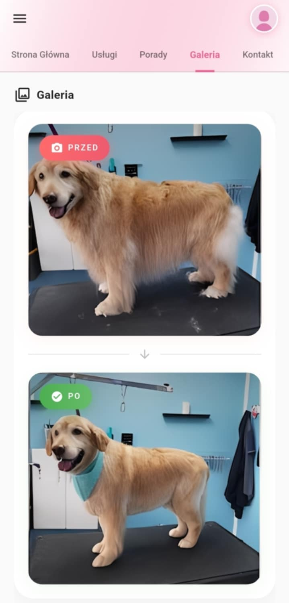
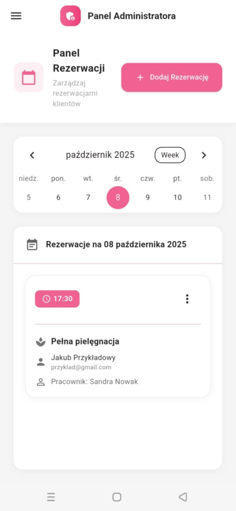

# 🐾 Pupilandia — Profesjonalny salon pielęgnacji dla Twojego pupila 💅

Pupilandia to aplikacja mobilna stworzona z myślą o właścicielach zwierząt, którzy chcą w prosty sposób zadbać o swojego pupila.  
Pozwala wygodnie rezerwować wizyty w salonie groomerskim, zarządzać terminami i korzystać z profesjonalnych usług pielęgnacyjnych – wszystko w jednym miejscu.

---

## 🎯 Cele projektu

Celem projektu **Pupilandia** jest stworzenie nowoczesnej i intuicyjnej aplikacji wspierającej działalność salonu groomerskiego.  
Aplikacja ma na celu:

- Ułatwienie klientom rezerwacji wizyt i kontaktu z salonem,  
- Zautomatyzowanie zarządzania harmonogramem usług,  
- Zwiększenie komfortu obsługi klientów,  
- Umożliwienie personalizacji oferty i komunikacji z właścicielami zwierząt,  
- Zapewnienie pełnej przejrzystości historii usług i wizyt,  
- Promowanie profesjonalnej pielęgnacji zwierząt w nowoczesny sposób.

---

## ✨ Najważniejsze funkcje

- 🗓 **Rezerwacja wizyt** – szybka i intuicyjna rezerwacja terminów online  
- 📆 **Kalendarz** – przegląd wszystkich zaplanowanych wizyt  
- 👩‍💼 **Panel administratora** – narzędzia do zarządzania salonem  
- 🧾 **Historia usług** – dostęp do pełnej historii wizyt  
- 🔔 **Powiadomienia** – przypomnienia o zbliżających się terminach  
- 📸 **Galeria zdjęć** – porównania „przed i po” zabiegach  
- 🐶 **Porady pielęgnacyjne** – praktyczne wskazówki dla właścicieli zwierząt  
- 📍 **Mapa** – szybki podgląd lokalizacji salonu  
- 🔐 **Bezpieczne logowanie** – autoryzacja użytkowników przez Firebase  

---

## 🛠️ Technologie

- **Flutter** – framework do budowy aplikacji wieloplatformowych  
- **Firebase** – autoryzacja, Firestore Database, przechowywanie zdjęć  
- **Google Maps** – integracja map z lokalizacją salonu  
- **Table Calendar** – komponent kalendarza  
- **Flutter Local Notifications** – powiadomienia lokalne  
- **Image Picker** – wybór zdjęć z galerii lub aparatu  

---

## 📱 Obsługiwane platformy

- **Android**  
- **Web**

---

## 🎨 Motyw i wygląd

Aplikacja utrzymana jest w jasnym, przyjaznym motywie z różowo-fioletową kolorystyką, tworząc ciepłą i estetyczną atmosferę.  
Interfejs zaprojektowano tak, by był prosty, intuicyjny i wygodny zarówno dla klientów, jak i administratorów salonu.

---

## 📸 Screeny aplikacji

Poniżej znajdziesz kilka widoków z aplikacji **Pupilandia** — od ekranu głównego po panel administratora.

### 🏠 Ekrany klienta i panel administratora

  
  
  

  
  
  

> 💡 *Wszystkie zrzuty ekranu pochodzą z działającej wersji aplikacji testowej (Flutter + Firebase).*

---

## 🚀 Instalacja i konfiguracja

### ⚠️ Wymagane: Konfiguracja kluczy API

Przed uruchomieniem projektu musisz skonfigurować klucze API. Repozytorium zawiera **placeholder'y** zamiast prawdziwych kluczy ze względów bezpieczeństwa.

**📖 Szczegółowe instrukcje:** Zobacz plik [`SECURITY_SETUP.md`](SECURITY_SETUP.md)

**Szybki start:**
1. Skopiuj `lib/api_keys.dart.template` jako `lib/api_keys.dart`
2. Wypełnij `lib/api_keys.dart` swoimi prawdziwymi kluczami API
3. (Opcjonalnie) Zaktualizuj klucz w `web/index.html` dla Google Maps
4. Uruchom `flutter pub get`
5. Uruchom aplikację: `flutter run`

---

## ⚙️ Konfiguracja Firebase

W projekcie wykorzystywane są następujące usługi Firebase:

- 🔑 **Authentication** – logowanie użytkowników  
- 💾 **Firestore Database** – przechowywanie danych wizyt i użytkowników  
- 🖼 **Storage** – przechowywanie zdjęć i multimediów  
- 🌐 **Hosting** – dla wersji webowej  

**Uprawnienia wymagane przez aplikację:**

- Dostęp do galerii zdjęć  
- Powiadomienia lokalne  
- Dostęp do lokalizacji (dla mapy)  

---

## 📄 Licencja

Projekt jest **prywatny** i przeznaczony do użytku wewnętrznego salonu **Pupilandia**.  
W przyszłości planowane jest jego opublikowanie w sklepie **Google Play**.

---

## 👨‍💻 Autor projektu

**Jakub Różycki**  
Wydział Automatyki, Elektroniki i Informatyki  
Politechnika Śląska
